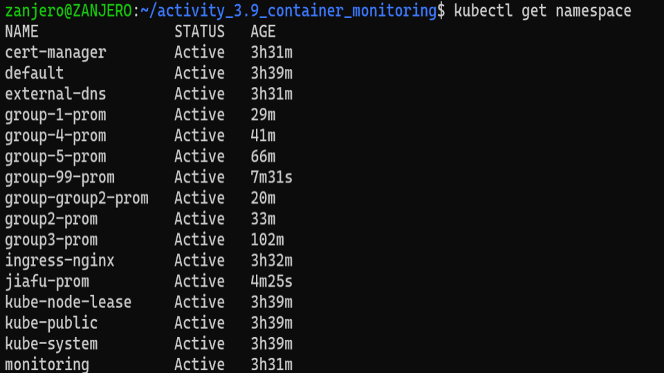
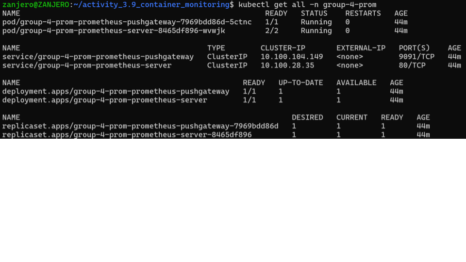

# Activity 3.9 Container Monitoring

# Instructions:
# Attach screenshot(s) of the following:
# • Your namespace
# • Show that your resources are deployed within your namespace /  Group Activity namespace (if it is a group    # activity)
# Submission would be your screenshots or Github repository if you’ve pushed your manifest files

# ANSWER:

1) namespace

2) resources 

